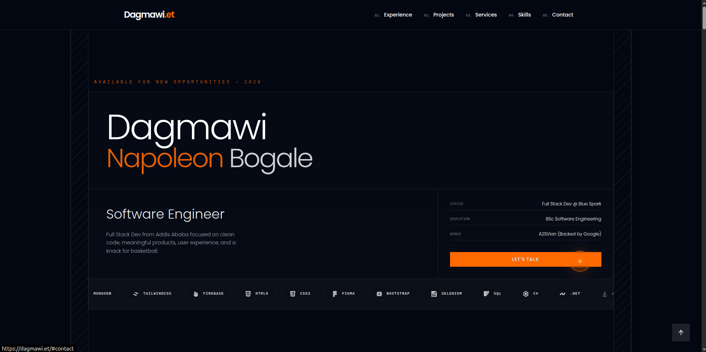

# Dagmawi Napoleon Bogale

### Software Engineer • Full Stack Developer • Backend Engineer

    
    
    
    

---

---

## About

This repository contains the second iteration of my personal portfolio.

The site was designed and developed to reflect the way I approach software engineering: clean architecture, thoughtful user experience, strong attention to detail, and a preference for building systems that are both practical and visually polished.

My work primarily focuses on backend engineering, API design, business systems, and full-stack web applications. Over the years I've built products ranging from real-time communication platforms and booking systems to enterprise-grade sales automation software used in production environments.

---

## Selected Work

The portfolio features a collection of projects developed professionally, collaboratively, and independently.

Notable projects include BlueSpark SFA, a large-scale Sales Force Automation platform; StreamSynx, a synchronized movie streaming platform; Gojo Getaways, a vacation rental ecosystem; Chewata Chat, a real-time messaging application; Spectate Interview Room, a collaborative technical interview environment; and several business platforms built for organizations operating in hospitality, recycling, healthcare, and education.

Each project showcases a different aspect of my experience, from backend architecture and database design to frontend development and product engineering.

---

## Philosophy

I enjoy building software that solves real problems.

Whether it is an enterprise business platform, a startup product, or a personal experiment, I care deeply about creating systems that are reliable, maintainable, and enjoyable to use. Good software should feel simple on the surface while hiding the complexity beneath.